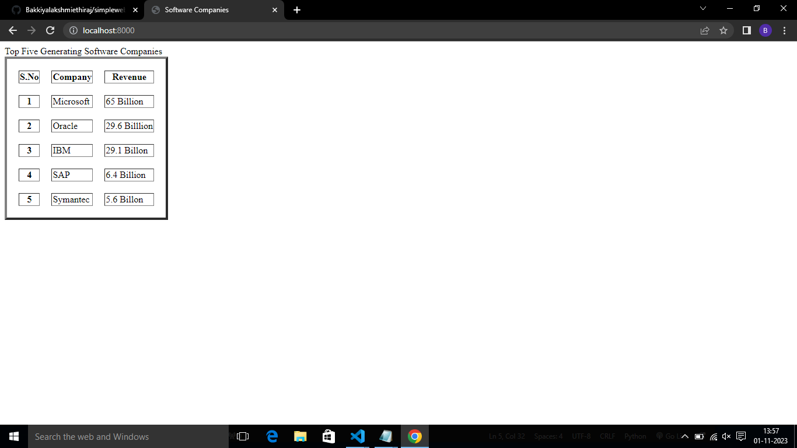
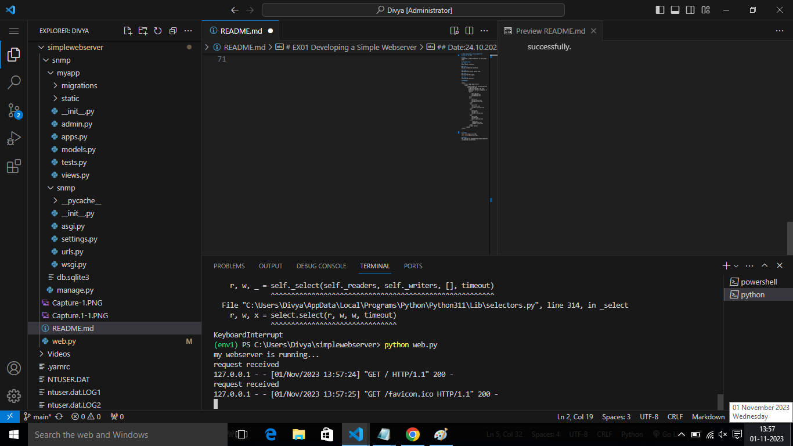

# EX01 Developing a Simple Webserver
## Date: 07.10.23

## AIM:
To develop a simple webserver to serve html pages.

## DESIGN STEPS:
### Step 1: 
HTML content creation.

### Step 2:
Design of webserver workflow.

### Step 3:
Implementation using Python code.

### Step 4:
Serving the HTML pages.

### Step 5:
Testing the webserver.

## PROGRAM:
```
<html>
    <title> image map </title>
     <body>
          <table border="4" cellspacing="20" cellspacing="15">
            <caption="centre"> Top Five Generating Software Companies </caption>
             <tr>
                 <th>S.No</th>
                 <th>Company</th>
                 <th>Revenue</th>
             </tr>
             <tr>
                 <th>1</th>
                 <td>Microsoft</td>          
                 <td>65 Billion</td>
              </tr>
              <tr>
                 <th>2</th>
                 <td>Oracle</td>             
                 <td>29.6 Billlion</td>
              </tr>
              <tr>
                 <th>3</th>
                 <td>IBM</td>          		
                 <td>29.1 Billon</td>
              </tr>
              <tr>
                 <th>4</th>
                 <td>SAP</td>
                 <td>6.4 Billion</td> 
              </tr>
                  <th>5</th>
                  <td>Symantec</td>
                  <td>5.6 Billon</td>
              </tr>
             </table border>
        </body>    
</html>  
```

## OUTPUT:




## RESULT:
The program for implementing simple webserver is executed successfully.